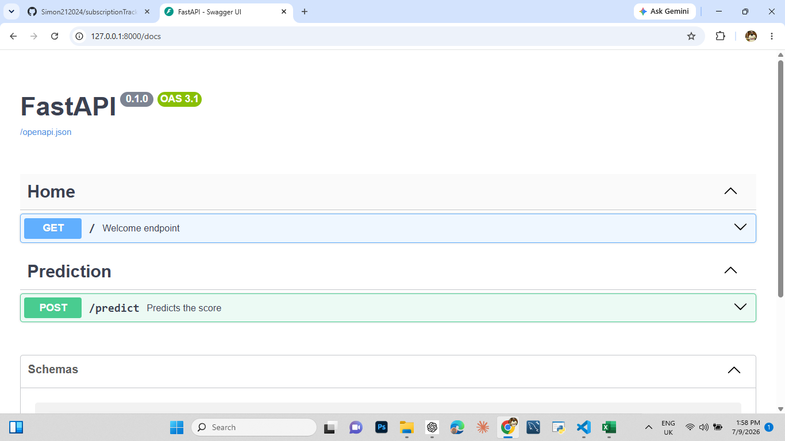
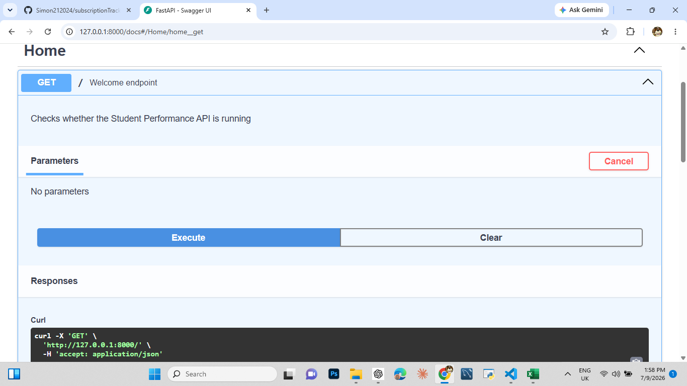
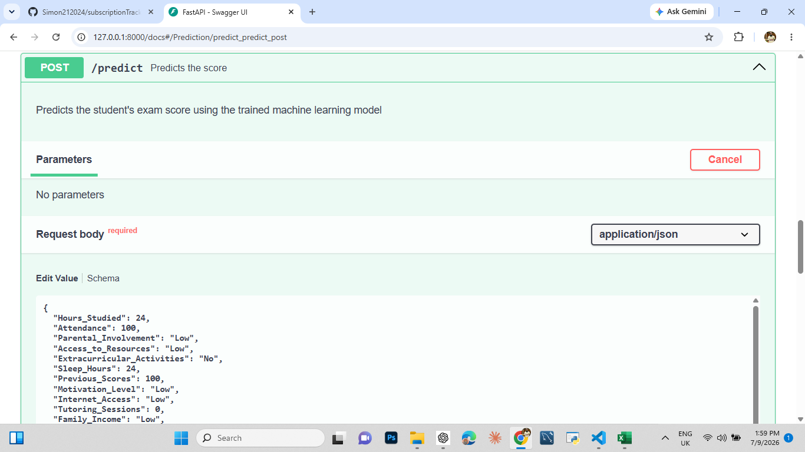
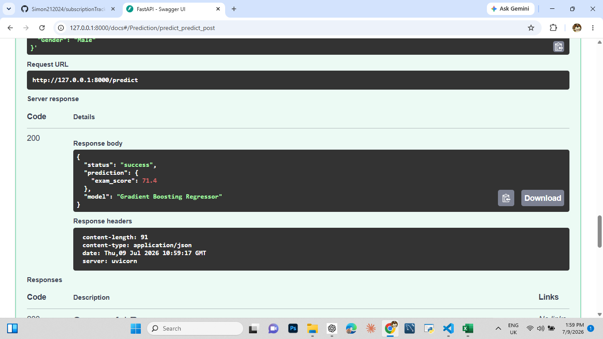
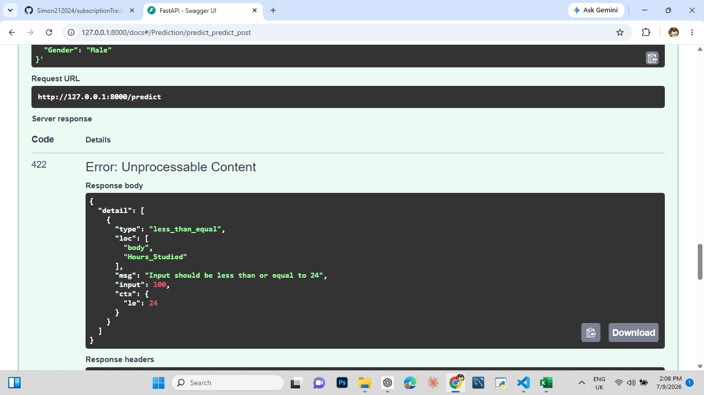

# Student Performance Prediction API

## Overview

Student Performance Prediction API is a machine learning application that predicts a student's expected examination score based on academic, personal, and environmental factors.

The project demonstrates the complete machine learning workflow from data preprocessing and model training to deployment using FastAPI.

---

## Problem Statement

Many schools identify struggling students only after examination results are released. By then, opportunities for early intervention may already have been missed.

This project helps teachers and school administrators identify students who may need additional academic support by predicting examination scores using relevant educational factors.

---

## Features

- Predict student examination scores
- Machine Learning model using Random Forest Regressor
- Data preprocessing pipeline
- Input validation using Pydantic
- FastAPI REST API
- Interactive Swagger Documentation
- Error handling
- Ready for integration into larger education systems

---

## Dataset Features

- Hours Studied
- Attendance
- Parental Involvement
- Access to Resources
- Extracurricular Activities
- Sleep Hours
- Previous Scores
- Motivation Level
- Internet Access
- Tutoring Sessions
- Family Income
- Teacher Quality
- School Type
- Peer Influence
- Physical Activity
- Learning Disabilities
- Parental Education Level
- Distance from Home
- Gender

Target Variable:

- Exam Score

---

## Model Performance

Algorithm:

- Random Forest Regressor

Results:

- R² Score: 0.75
- MAE: 1.06
- RMSE: 2.14

---

## Technologies Used

- Python
- Pandas
- NumPy
- Scikit-Learn
- FastAPI
- Pydantic
- Joblib
- Uvicorn

---

## Running the API

Install dependencies:

```bash
pip install -r requirements.txt
```

Start the server:

```bash
python -m uvicorn api.main:app --reload
```

Open Swagger Docs:

```text
http://127.0.0.1:8000/docs
```

---

## Example Response

```json
{
  "predicted_score": 78.4
}
```

---
## Swagger Documentation

### Swagger Welcome



---
### GET Endpoint



---

### Prediction Endpoint



---

### Successful Prediction



---

### Validation Example



## Future Improvements

- Deploy online
- Build a web frontend
- Integrate into a Student Management System
- Add authentication and user accounts
- Experiment with additional machine learning models

---

## Developer

Kasibante Simon

Bachelor of Science in Computer Engineering

Busitema University
